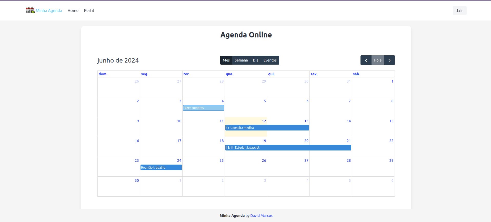

## 
<div style="display: flex; align-items: center;">
  
  <span style="margin-left: 10px; font-size: 24px; font-weight: bold;">Minha Agenda</span>
</div>
<hr>

Seja bem-vindo ao repositório da aplicação Minha Agenda. Está aplicação consiste em um sistema de agendamento web, onde os usuários podem cria eventos de maneira fácil e intuitiva.



## Arquitetura da Aplicação:

A arquitetura da aplicação é composta por uma arquitetura cliente-servidor, onde temos o cliente sendo o front-end da aplicação e o back-end sendo o servidor, além do banco de dados para a persistência dos dados.

## Tecnologias Utilizadas no Projeto:

Para a criação da arquitetura da aplicação foram utilizados:

- Docker
- Docker Compose

Para o Front-end da aplicação foram utilizados:

- Vue.js
- HTML
- CSS
- Bulma Css

Para o Back-end da aplicação foram utilizados:

- Node.js
- Express.js

Para o Banco de Dados da aplicação foi utilizado:

- PostgreSQL

## Rodando o Projeto:

### Dependências:

É necessário ter instalado o Docker e o Docker Compose no seu computador para rodar o projeto.

Para isso, acesse: [Instalar Docker](https://docs.docker.com/engine/install/) e [Instalar Docker Compose](https://docs.docker.com/compose/install/).


### Execultando o projeto:

Dentro da pasta do projeto, execulte o comando:

```
 docker compose up --build
```


Se tudo ocorrer bem voce deve ser capaz de acessar aplicação no seu navegador acessando a rota:


```
 http://localhost:8080/
```

